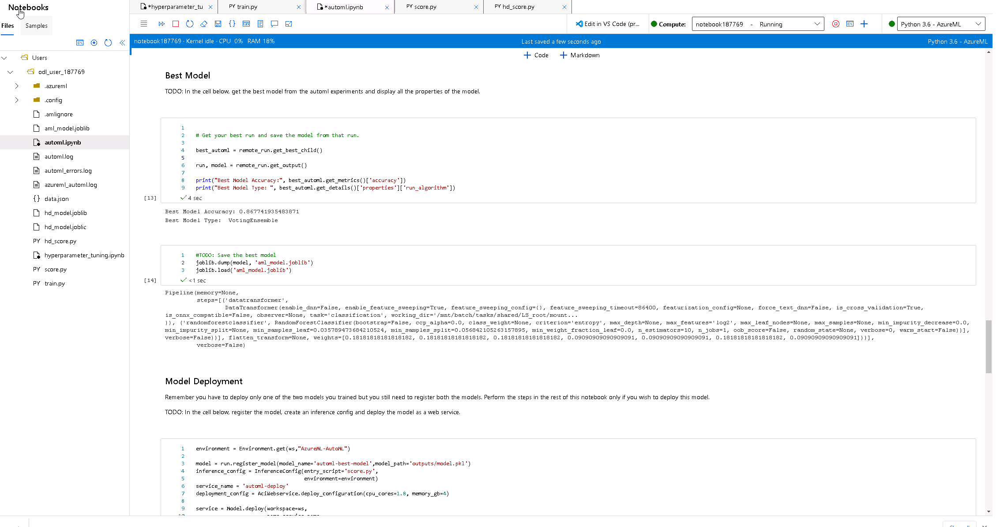

# Azure ML Nanodegree Capstone Project - Deploying Models for Predicting Heart Disease

This project is a submission for the capstone project of the Udacity Azure ML Nanodegree. The project covers the use of Azure ML studio for training a model and deploying an endpoint, comparing the performance of models trained using Hyperdrive and AutoML. 

## Project Set Up and Installation
The project can be set up by first logging into Azure and then opening ML Studio. There are two notebooks with this project, `automl.ipynb` and `hyperparameter_tuning.ipynb`, three scripts named `train.py`, `hd_score.py` and `score.py`, accompanied by a dataset `heart.csv` and an environment file `conda_dependencies.yml`. 

In ML studio, load and register the dataset. Then upload the remaining files into the notebook directory and run through the desired notebook. Both notebooks will:
- Import the required modules
- Connect to the workspace
- Create the experiment
- Create the cluster for training 
- Configure the method, whether Hyperdrive or AuotML
- Train the model and provie a `RunDetails` widget to view progress
- Extract the best model and copy it to the local directory as a .joblib file
- Register the model into ML Studio, with versioning
- Deploy the endpoint for the model
- Enable insights on the endpoint
- Test the endpoint model with 2 JSON payloads
  - Testing with a post request to the scoring URI
  - Testing by running the input through the endpoint service that was created using Azure SDK.
- Print the logs of the endpoint
- Close the endpoint and any other clusters that were created for the notebook.  

## Dataset
### Overview
The dataset is the [Heart Disease UCI](https://www.kaggle.com/ronitf/heart-disease-uci) dataset from Kaggle. There are 13 feature columns which contain properties or characteristics of an individual, all values are numerically encoded but essentially the data is a mixture of categorical data and continuous numerical. There is a `target` column which is the actual classification of the individual, which determines if they do have heart disease or not.

### Task
The data is used to create a classification model using AutoML and Hyperdrive (Logistic Regression), to model the likelihood of an individual having heart disease based on the other provided properties. The desired outcome is to have a highly accurate predictive model that can be used to predict if an individual is likely to have heart disease based on the same set of data. 

### Access
The dataset is registered into the ML studio workspace and is accessed directly from the notebooks and scripts using the `workspace.datasets[key]` method, where the `key` is the name of the dataset.

## Automated ML
For the `automl` settings and configuration, the task was set to `classification` given the objective is to predict the classification of an individual's heart disease status. Given the dataset is relatively small with around 300 records, and has 13 predictors, 1 hour seemed like a reasonable experiment timeout time as the best model would have been obtained before then. The primary metric selected in this case was the `accuracy` of prediction. The dataset classes are well balanced and given the comparison will be to a hyperdrive logistic regression, this is a good metric for comparison. 

### Results
The best AutoML model was a VotingEnsemble with an `accuracy` of `0.868`. In addition to the timout being 1 hour and 5 concurrent iterations, the `featurization` was also set to `auto` and `enable_early_stopping` was set to `true`. The models from AutoML did not perform as well as the much simpler logistic regression method using hyperdrive. One potential way to improve this is by setting the `enable_early_stopping` to `false` because looking at the data it appears the stopping criteria is met becauase there are 10 steps with no improvement in accuracy, but the AutoML algorithm will still run 2 more steps and in one of those the VotingEnsemble was found. So perhaps the iterative approach at finding the best model was terminated early by this configuration. 

### AutoML Run Details

### AutoML Best Model



## Hyperparameter Tuning
*TODO*: What kind of model did you choose for this experiment and why? Give an overview of the types of parameters and their ranges used for the hyperparameter search

For the hyperparamete search using Hyperdrive, a scikit-learn logistic regression model was used. This was selected because the problem type here is a binary classification problem which makes the logistic regression an appropriate model type, and there are two parameters that can be tuned from this model type. The chosen tuning parameters are the `regularization (C)` and `maximum iterations (max_iter)`. The values for regularization were set to discrete selections between 0.001 and 100 and the maximum iterations set to 10 or 25. The primary metric was `accuracy` with maximum runs set to 24. The total runs would have been 12 in this case given 6 values of regularization were used and 2 values for maximum iteration, but 24 was set in case the set of values was increased.

### Results
The best logistic regression model had a `regularization` value of `1` and `maximum iterations` set to `25`. The `accuracy` of the model was `0.882`, marginally better than the AutoML VotingEnsemble model. For improvements, it looks like the regularization parameter could be refined to add more values between the 0.1 to 10 range as the values selected were all increasing by a factor of 10. The maximum iterations being increased from 25 to 50 or 100 may also be useful to see if the same model could have been improved with further iterations. With an accuracy of 88% though, this model has very good predictive capability.

### Hyperdrive Run Details

### Hyperdrive Experiment Run

### Hyperdrive Best Model


## Model Deployment
*TODO*: Give an overview of the deployed model and instructions on how to query the endpoint with a sample input.
The deployed model is the Hyperdrive Logistic Regression model. A script was created for hyperdrive inference, `hd_score.py`. In the notebook there is a cell which creates the `InferenceConfig` with this script and the environment. 

The model is deployed as an ACI endpoint using the `AciWebService` class and the `deploy_configuration` method, where the cpu cores and memory can be set. 

The service is then deployed using the `Model.deploy` class method, using the deployment configuration, inference configuration, model and workspace. The insights are subsequently enabled. 

Once the endpoint has successfully been deployed and is healthy, it can be interacted with by either sending a post request to the URI, or by using the `service.run` command, given the service is set up as the deployed model. 

First create a data variable in the following format:
```
data = {"data": 
        [
        {"age": 37,
        "sex": 0,
        "cp": 1,
        "trestbps": 150,
        "chol": 233,
        "fbs": 1,
        "restecg": 0,
        "thalach": 190,
        "exang": 0,
        "oldpeak": 0.6,
        "slope": 2,
        "ca": 0,
        "thal": 1}
        ]
        }
```
The `"data"` dictionary key can contain a list of multiple JSON inputs to post to the deployed model. The `data` variable must be converted to an input using `json.dumps(data)` and that input can be posted to the endpoint using `service.run(input)`. The endpoint service will return the values for the classes of each input.


## Screen Recording
The screencast can be found [here](https://www.youtube.com/watch?v=hZM1Ci5-v-4).
The screencast demonstrates:
- A working model
- Demo of the deployed model
- Demo of a sample request sent to the endpoint and its response
